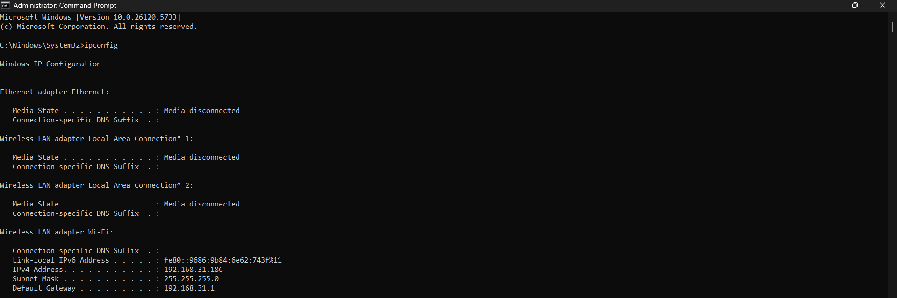
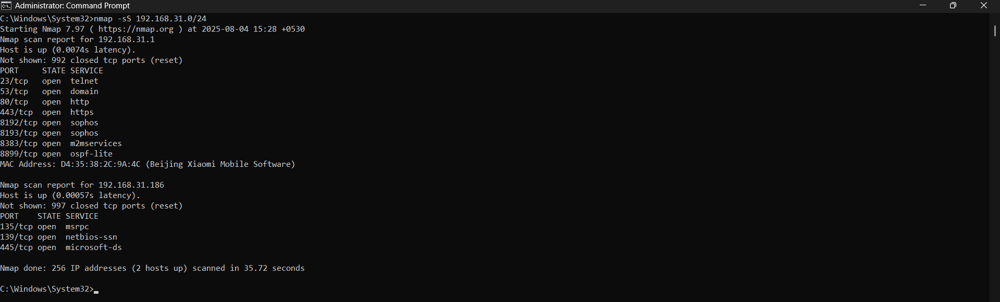

# Task 1 – Network Port Scanning using Nmap

## Objective
To perform basic network reconnaissance and identify open ports on devices within the local network using **Nmap**.

---

## Tools Used
- **Nmap** – for port scanning
- **CMD (Command Prompt)** – to check IP configuration
- **Windows 10 OS**

---

##  My Network Info
- **Local IP:** 192.168.31.186
- **IP Range Scanned:** 192.168.31.0/24

---

## Scan Results

The raw output of the TCP SYN scan is also available here:  
📄 [scan_results.txt](./scan_results.txt)

### Host 1: `192.168.31.1` (likely the router)
- Open Ports:
  - `23` – Telnet (Insecure)
  - `53` – DNS
  - `80` – HTTP
  - `443` – HTTPS
  - `8192`, `8193`, `8383`, `8899` – Unknown/Custom services

### Host 2: `192.168.31.186` (my system)
- Open Ports:
  - `135`, `139`, `445` – Microsoft RPC/SMB Services

---

## Screenshots
 

---

##  Security Insight
- Port `23` (Telnet) is insecure and should be disabled on the router.
- Ports `135`, `139`, `445` are commonly targeted in SMB vulnerabilities.
- Custom services (8192–8899) could be potential attack surfaces if misconfigured.

---

## Bonus: Wireshark Packet Capture

Included a live packet capture of the Nmap TCP SYN scan using Wireshark.

File: `./captures/nmap_scan_capture.pcapng`  
You can open this file in Wireshark to explore:

- SYN packets sent from scanner (my IP: 192.168.31.186)
- SYN-ACK responses from open ports (e.g., 80, 443)
- RST responses from closed ports
- TCP Flags like SYN, ACK, and RST

---

## Learning Outcomes
- Understood IP ranges and subnetting
- Performed TCP SYN scans using Nmap
- Analyzed exposed services
- Learned how open ports pose potential risks

---

> Task completed as part of Elevate Labs Cyber Security Internship Program.
